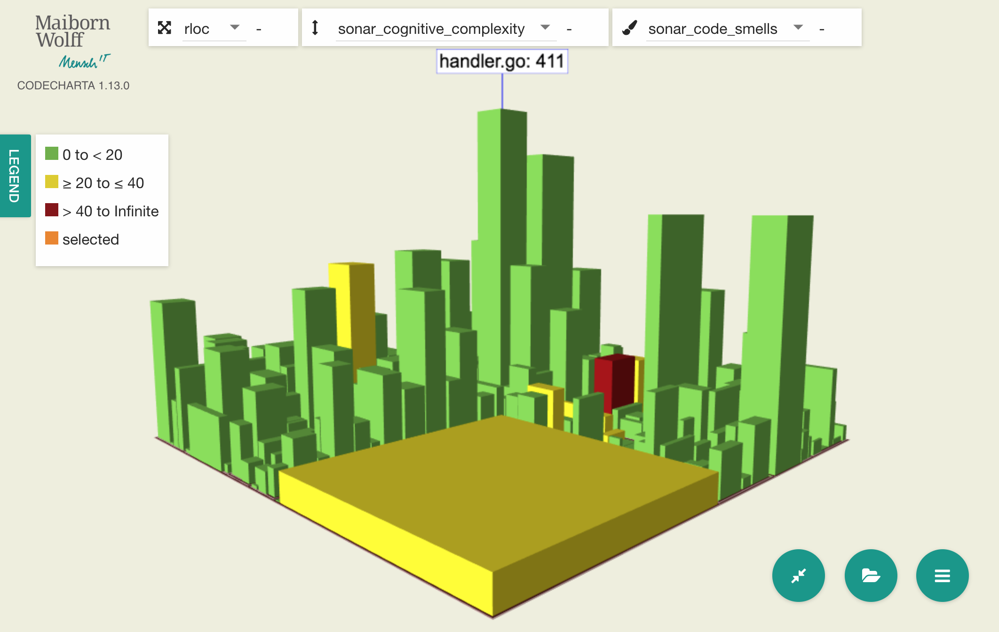
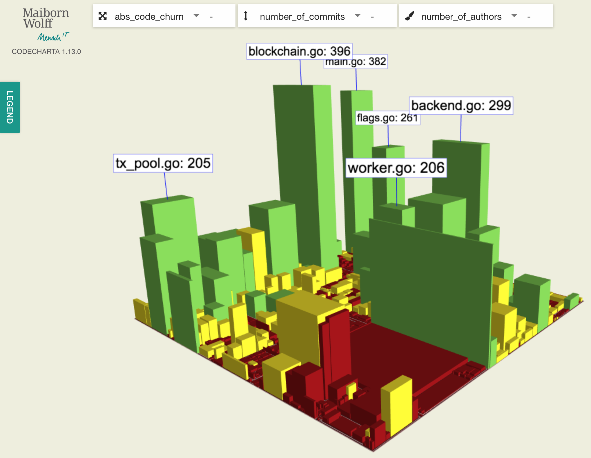

# Code Charta für Ethereum

## Komplexe Software im Alltag

Umfangreiche und komplexe Projekte mit mehreren tausend LoC machen es schwer, sich einen Überblick über den Zustand der Software zu verschaffen. Das gilt selbst für versierte Entwickler, und umso mehr für nicht-technische Stakeholder, die wir bei Präsentationen und Vorstellungen abholen und mitnehmen.

Daher hat MaibornWolff die [CodeCharta](https://maibornwolff.github.io/codecharta/) entwickelt, mit der verschiedenste Metriken verständlich visualisiert werden können und Änderungen im Verlauf der Zeit sichtbar werden.

Dabei ist es keineswegs das Ziel der CodeCharta, bekannt Methoden wie statische Code-Analyse zu ersetzten. Vielmehr steht die Aufwertung der bestehenden Daten im Vordergrund. Schlichte Zahlen werden so plastisch durch 3D-Formen und aussagekräftige Farben.

Eine hohe Codequalität ist besonders relevant bei Software die Assets oder monetäre Werte verwaltet, da dort die Auswirkungen von Fehlern schwerwiegende Folgen wie dem Totalverlust zur Folge haben können. Im folgenden haben wir uns die Go Ethereum Client Implementierung (kurz: [geth](https://github.com/ethereum/go-ethereum)) angeschaut, dem zur Zeit populärsten Ethereum-Client.

## CodeCharta als flexibles Tool

CodeCharta unterstützt verschiedene Backends und Datenquellen zur Generierung von Metriken. Unter anderem wird SonarQube verwendet, welches neben Java und .Net über Plugins viele weitere Sprachen unterstützt. Das macht es uns für die überwiegend in Go geschriebene Implementierung sehr einfach, die Metriken zu sammeln. Mit wenigen Zeilen Konfiguration läuft der sonar-scanner schon:

```ini
sonar.projectKey=go-ethereum
sonar.organization=<organisation>
sonar.sources=.
sonar.host.url=https://sonarcloud.io
sonar.login=<token>

sonar.java.binaries=.
sonar.cfamily.build-wrapper-output.bypass=true

sonar.go.coverage.reportPaths=./coverage.out
sonar.exclusions=**/*_test.go,**/vendor/**,**/internal/**,**/node_modules/**,crypto/secp256k1/libsecp256k1/src/tests.c,build/**
```

Um die Genauigkeit der Metriken zu verbessern schließen wir Verzeichnisse mit externem und generierten Code und Tests aus.
Für die Test-Coverage inkludieren wir den Report aus dem Go eigenem Test-Tool: ``go test -coverprofile=coverage.out .``

Zusammen werden alle Daten an die [sonarcloud.io](sonarcloud.io) Plattform geliefert, welche sie sammelt, aufbereitet und analysiert.

Um daraus eine Karte bauen zu können, exportieren wir die Ergebnisse lokal: ``ccsh sonarimport https://sonarcloud.io <project-name> -o cc.json``

Und schon können wir uns und anderen einen schnellen Überblick über die Code-Basis verschaffen:



Komplexe Dateien werden durch hohe Wolkenkratzer repräsentiert, eine Häufung von potenziellen Bugs durch Farbgebung von grün bis rot. Bei unserem Beispielprojekt sieht es also ganz gut aus, wir haben keine roten Türme.

## Bus-Faktor

Nicht nur der eigentliche Code kann analysiert werden, auch die Metadaten rund um seine Entstehung und Pflege sind interessant.Ein Beispiel: 

Bug-Fixes oder sich ändernde Funktionalität können häufige Code-Änderungen nach sich ziehen. Der Code wird so komplexer. Für diese Dateien ist es entscheidend, dass mehrere Entwickler mit dem Code vertraut sind.

Eine populäre Metrik dafür ist der sog. [Bus-Faktor](https://en.wikipedia.org/wiki/Bus_factor), auch Truck-Faktor genannt.
Er beschreibt das Risiko, dass ein Projekt komplett zum Erliegen kommt, wenn ein substanzieller, nicht-ersetzbarer Teil des Entwicklerteams plötzlich wegfällt. Der Name "Bus-Faktor" bezieht sich dabei auf die Vorstellung, welche Auswirkungen ein Bus-Unfall beim Team-Ausflug hätte.

Direkt ablesen oder bestimmen lässt sich das natürlich nicht, dennoch können wir uns über mehrere Hilfsfaktoren zumindest nähern.
Dabei nehmen wir zum einen die Anzahl der Commits, in denen eine Datei geändert wurde; zum anderen die Fluktuationsquote des Codes innerhalb der Datei.

Dem stellen wir die Anzahl der Autoren gegenüber, die an dieser Datei mitgewirkt haben, und unterstellen diesen ein zumindest grundlegendes Verständnis des Inhalts.

Als Datenquelle dient hier das Log aus Git oder einem anderen Versionskontrollsystem.
Dazu wird der komplette Verlauf aller Änderungen über alle Dateien exportiert und anschließend mit einem Hilfstool der CodeCharta konvertiert:

````bash
git log --numstat --raw --topo-order . ":!tests" ":!vendor" ":!build" ":!internal" > git-log.txt
ccsh scmlogparser git-log.txt --input-format GIT_LOG_NUMSTAT_RAW -o scm.json
````

Nach dem Import in die Webanwendung zu Visualisierung erhalten wir folgenden Stadt:



Die Höhe eines Gebäudes steht hierbei für die Anzahl der Commits an dieser Datei, die Farbe für die Anzahl der Autoren.

Dabei wird Wichtigkeit des Zusammenspiels der beiden Faktoren verdeutlicht: Einzig eine geringe Anzahl an Autoren allein ist noch nicht aussagekräftig, da manche Dateien nach ihrer initialen Erstellung noch nie verändert wurden (z.B. Konfigurationsdateien). Durch die CodeCharta wird hier beides korreliert; dadurch ist sofort sichbar, wo Probleme auftreten können: Dann sehen wir einen hohen roten Turm. In unserem Beispiel ist dies glücklicherweise nicht der Fall. Alle komplexen Dateien wurden von mindestens 10 verschiedenen Leuten erstellt.

Die Bespiele zeigen, wie die Code Charta eingesetzt werden kann, um verdeckte Faktoren eines Projekts sichtbar und anschaulich zu machen. Die Darstellung ist sofort eingängig, egal ob jemand einen technischen Hintergrund hat oder nicht. Damit eignet sie sich gut für die Interaktion mit Shareholdern.

Mich persönlich hat überrascht wie schnell man mit der CodeCharta zu ersten Ergebnissen kommt. Viele Tools, die meine Arbeit verbessern oder erleichtern sollen, haben eine immense Einstiegshürden. Ich möchte nicht erst zehn Services herunterladen, konfigurieren und starten müssen, um das erste Bild zu sehen. Dank der gehosteten Instanzen der [CodeCharta Online](https://maibornwolff.github.io/codecharta/visualization/app/index.html) und [sonarcloud.io](sonarcloud.io) kann jeder sofort mit seinem OpenSource Projekt starten.